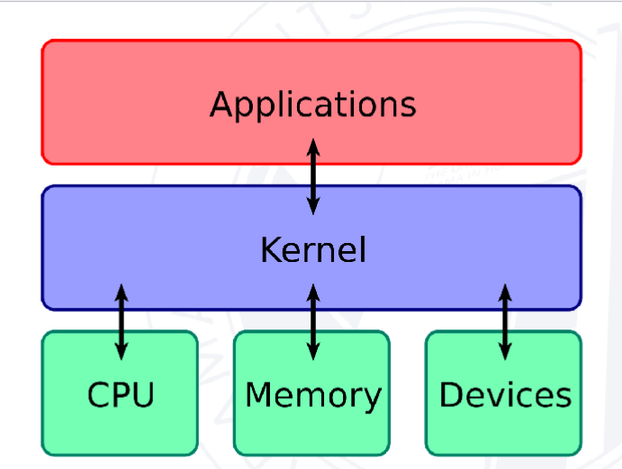
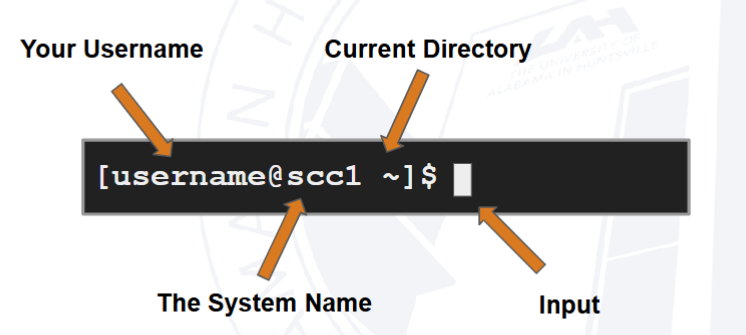
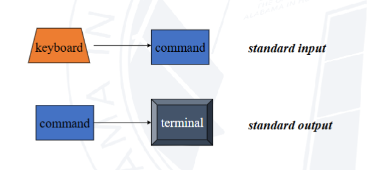
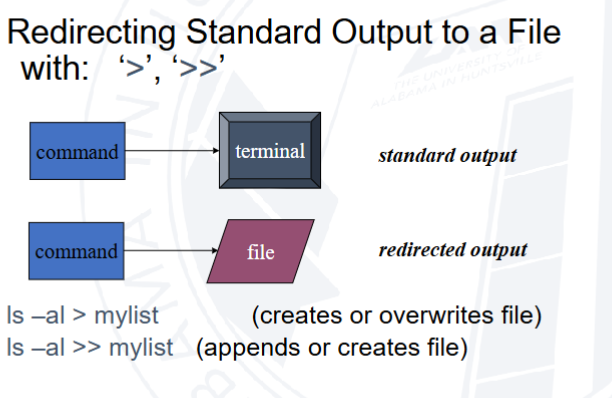
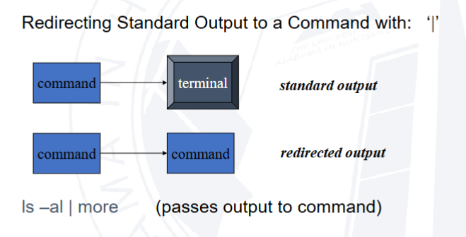
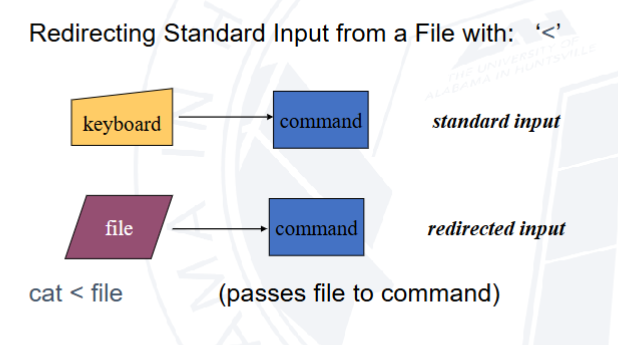
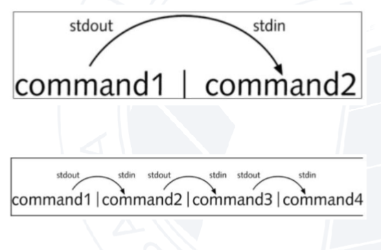
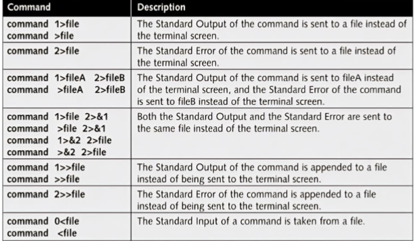

tags:: Bash

- # Bash fundamentals
- Bash is a shell- prints the prompt and interprets
	- {:height 266, :width 342}
- Bash is the root of scripting
- Shell scripts are common on Unix and Linux systems
- Shells scripts evolved from a workflow
	- Sequence of commands placed in a file
	  logseq.order-list-type:: number
	- Command line options enable different options to be passed to commands
	  logseq.order-list-type:: number
	- Introduce variables, if tests, loops enables more complex programming flow
	  logseq.order-list-type:: number
- Can also be an intermediary between other languages
- # Bash Terminal and Commands
- ## Using the shell
- 
  id:: 68fc055c-baa7-476d-bbb0-a48132b00d50
	- ~ is a shorthand for home directory in this case
- ### Example commands
- ```bash
  [username@scc1 ~]$ command --option argument
  ```
- Command- does one thing
- Options- change the way command does the thing
- Argument-provides input/output that the command interacts with
- Can use man or info to get info
- History command to see shell history
- [[Text processing]]
- ### Variables
- ```bash
  USER=test
  echo $test
  export $test
  ```
- Too see environment variables use the printenv command
- # Input Output in Bash
- I/O is important to interact with users, data processing, automation and scripting tasks, interaction with other programs, error handling
- Bash input-received data from user
- Bash output-refers to info or data that the program generates or writes
- ### Standard Input and Output
- 
-
- ### Redirection and Pipes
- {:height 265, :width 291}
- {:height 173, :width 291}
- {:height 199, :width 286}
- ### Pipelines
- 
- ### Types of Redirection
- 
-
- ## File Descriptors
- Standard input - stdin
	- Interactively read input from user from another command using standard input
- Standard output - stdout
	- Allows you to display output using standard output
- Standard error- stderr
	- Handles error messages
- ## File Redirection
- Basic I/O manipulation
- ```bash
  echo "This is example code" > story
  cat story
  cat < story
  ```
- ## Pipelines
- Redirect output of command into standard input
- ```bash
  ls -l | more
  ```
-